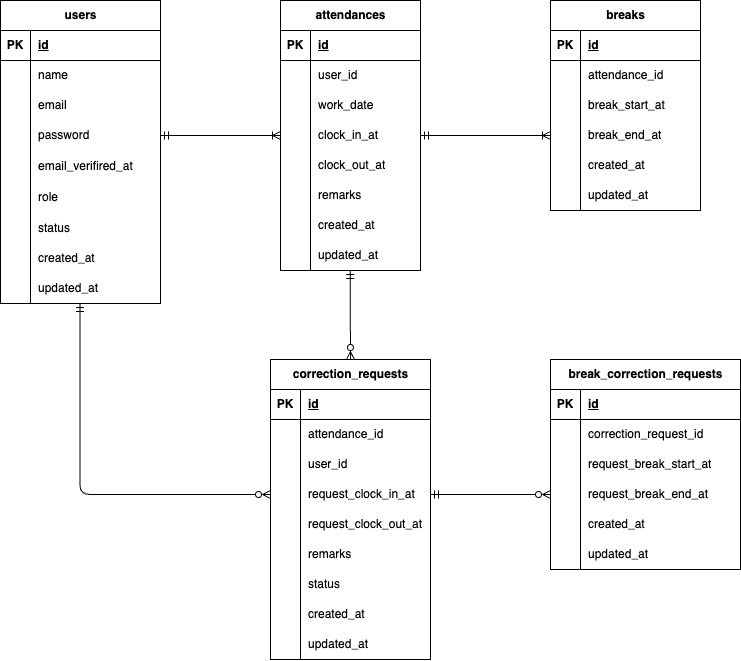

# attendance-management-system

## 環境構築

**Dockerビルド**

#### 1.リポジトリをクローン

```bash
git clone git@github.com:ktpsc000/attendance-management-system.git
```

#### 2.ディレクトリへ移動

```bash
cd attendance-management-system
```

#### 3.DockerDesktopアプリを立ち上げる

#### 4.Dockerコンテナをビルド・起動

```bash
docker compose up -d --build
```

> _MacのM1・M2チップのPCの場合、`no matching manifest for linux/arm64/v8 in the manifest list entries`のメッセージが表示されビルドができないことがあります。
> エラーが発生する場合は、docker-compose.ymlファイルの「mysql」内に「platform」の項目を追加で記載してください_

```bash
mysql:
    platform: linux/x86_64(この文追加)
    image: mysql:8.0.26
    environment:
```

**Laravel環境構築**

#### 1.PHPコンテナへログイン

```bash
docker compose exec php bash
```

#### 2.Composerをインストール

```bash
composer install
```

#### 3.Stripeをインストール

```bash
composer require stripe/stripe-php
```

#### 4.`.env`ファイルを作成

```bash
cp .env.example .env
```

#### 5.`.env`に以下の環境変数を追加

```env
DB_CONNECTION=mysql
DB_HOST=mysql
DB_PORT=3306
DB_DATABASE=laravel_db
DB_USERNAME=laravel_user
DB_PASSWORD=laravel_pass

MAIL_MAILER=smtp
MAIL_HOST=mailhog
MAIL_PORT=1025
MAIL_USERNAME=null
MAIL_PASSWORD=null
MAIL_ENCRYPTION=null
MAIL_FROM_ADDRESS=test@example.com
MAIL_FROM_NAME="${APP_NAME}"

STRIPE_KEY=pk_test_xxxxxxxxx
STRIPE_SECRET=sk_test_xxxxxxxxx
```

#### 6.アプリケーションキーの作成

```bash
php artisan key:generate
```

#### 7.ディレクトリ権限の設定

```bash
mkdir -p storage/logs bootstrap/cache
chown -R www-data:www-data storage bootstrap/cache
chmod -R 775 storage bootstrap/cache
```

#### 8.マイグレーションの実行

```bash
php artisan migrate
```

#### 9.シーディングの実行

```bash
php artisan db:seed
```

#### 10.シンボリックリンク作成

```bash
php artisan storage:link
```

#### 11.設定の反映

```bash
php artisan config:clear
php artisan config:cache
exit
```

## テスト環境の構築

#### 1.MySQLに接続

```bash
docker compose exec mysql bash
```

#### 2.MySQLにrootでログイン

```bash
mysql -u root -p
```

パスワードは`root`です。

#### 3.テスト用データベースの作成

```SQL
CREATE DATABASE demo_test;
```

#### 4.`env.testing`ファイルを作成

phpコンテナ上で

```bash
cp .env.example .env.testing
```

#### 5.`env.testing`の以下を編集

```env.testing
APP_NAME=Laravel
APP_ENV=test
APP_KEY=
APP_DEBUG=true
APP_URL=http://localhost

DB_CONNECTION=mysql_test
DB_HOST=mysql
DB_PORT=3306
DB_DATABASE=demo_test
DB_USERNAME=root
DB_PASSWORD=root
```

#### 6.テスト用アプリケーションキー作成

```bash
php artisan key:generate --env=testing
```

#### 7.キャッシュ削除、テーブル作成

```bash
php artisan config:clear
php artisan migrate --env=testing
```

## 使用技術(実行環境)

- PHP 8.1.34
- Laravel 8.83.29
- MySQL 8.0.26
- nginx 1.21.1
- mailhog

## ER図



## テーブル設計

### usersテーブル

| カラム名          | 型              | PRIMARY KEY | UNIQUE KEY | NOT NULL | FOREIGN KEY |
| ----------------- | --------------- | ----------- | ---------- | -------- | ----------- |
| id                | unsigned bigint | ○           |            | ○        |             |
| name              | varchar(255)    |             |            | ○        |             |
| email             | varchar(255)    |             | ○          | ○        |             |
| password          | varchar(255)    |             |            | ○        |             |
| email_verified_at | timestamp       |             |            |          |             |
| role              | tinyint         |             |            | ○        |             |
| status            | tinyint         |             |            | ○        |             |
| created_at        | timestamp       |             |            |          |             |
| updated_at        | timestamp       |             |            |          |             |

---

## URL

- 開発環境：http://localhost/
- phpMyAdmin:：http://localhost:8080/

## 補足
# attendance-management-system
