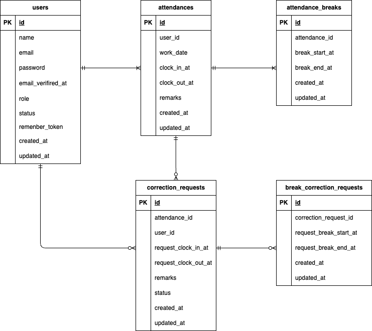

# attendance-management-system

## 環境構築

**Dockerビルド**

#### 1.リポジトリをクローン

```bash
git clone git@github.com:ktpsc000/attendance-management-system.git
```

#### 2.ディレクトリへ移動

```bash
cd attendance-management-system
```

#### 3.DockerDesktopアプリを立ち上げる

#### 4.プロジェクト直下で、以下のコマンドを実行する

```
make init
```


## テストアカウント
name: ユーザ−2（一般）
email: user1@example.com
password: password
-------------------------
name: ユーザ−2（一般）
email: user1@example.com
password: password
-------------------------
name: ユーザ−3（管理者）
email: user3@example.com
password: password

## PHPUnitを利用したテストに関して
以下のコマンド:
```
//テスト用データベースの作成
docker-compose exec mysql bash
mysql -u root -p
//パスワードはrootと入力
create database test_database;

docker-compose exec php bash
php artisan migrate:fresh --env=testing
./vendor/bin/phpunit
```

## 使用技術(実行環境)

- PHP 8.1.34
- Laravel 8.83.29
- MySQL 8.0.26
- nginx 1.21.1
- mailhog

## ER図



## テーブル設計

### usersテーブル

| カラム名 | 型 | PRIMARY KEY | UNIQUE KEY | NOT NULL | FOREIGN KEY |
|---|---|---|---|---|---|
| id | unsigned bigint | ○ | | ○ | |
| name | varchar(255) | | | ○ | |
| email | varchar(255) | | ○ | ○ | |
| password | varchar(255) | | | ○ | |
| email_verified_at | timestamp | | | | |
| role | tinyint | | | ○ | |
| status | tinyint | | | ○ | |
| remember_token | varchar(100) | | | | |
| created_at | timestamp | | | | |
| updated_at | timestamp | | | | |


### attendancesテーブル

| カラム名 | 型 | PRIMARY KEY | UNIQUE KEY | NOT NULL | FOREIGN KEY |
|---|---|---|---|---|---|
| id | unsigned bigint | ○ | | ○ | |
| user_id | unsigned bigint | | | ○ | users(id) |
| work_date | date | | | ○ | |
| clock_in_at | datetime | | | | |
| clock_out_at | datetime | | | | |
| remarks | text | | | | |
| created_at | timestamp | | | | |
| updated_at | timestamp | | | | |

**制約**

- UNIQUE(user_id, work_date)


### attendance_breaksテーブル

| カラム名 | 型 | PRIMARY KEY | UNIQUE KEY | NOT NULL | FOREIGN KEY |
|---|---|---|---|---|---|
| id | unsigned bigint | ○ | | ○ | |
| attendance_id | unsigned bigint | | | ○ | attendances(id) |
| break_start_at | datetime | | | ○ | |
| break_end_at | datetime | | | | |
| created_at | timestamp | | | | |
| updated_at | timestamp | | | | |


### correction_requestsテーブル

| カラム名 | 型 | PRIMARY KEY | UNIQUE KEY | NOT NULL | FOREIGN KEY |
|---|---|---|---|---|---|
| id | unsigned bigint | ○ | | ○ | |
| attendance_id | unsigned bigint | | | ○ | attendances(id) |
| user_id | unsigned bigint | | | ○ | users(id) |
| request_clock_in_at | datetime | | | ○ | |
| request_clock_out_at | datetime | | | ○ | |
| remarks | text | | | ○ | |
| status | tinyint | | | ○ | |
| created_at | timestamp | | | | |
| updated_at | timestamp | | | | |


### break_correction_requestsテーブル

| カラム名 | 型 | PRIMARY KEY | UNIQUE KEY | NOT NULL | FOREIGN KEY |
|---|---|---|---|---|---|
| id | unsigned bigint | ○ | | ○ | |
| correction_request_id | unsigned bigint | | | ○ | correction_requests(id) |
| request_break_start_at | datetime | | | ○ | |
| request_break_end_at | datetime | | | ○ | |
| created_at | timestamp | | | | |
| updated_at | timestamp | | | | |

---

## URL

- 開発環境：http://localhost/
- phpMyAdmin:：http://localhost:8080/

## 補足
# attendance-management-system
